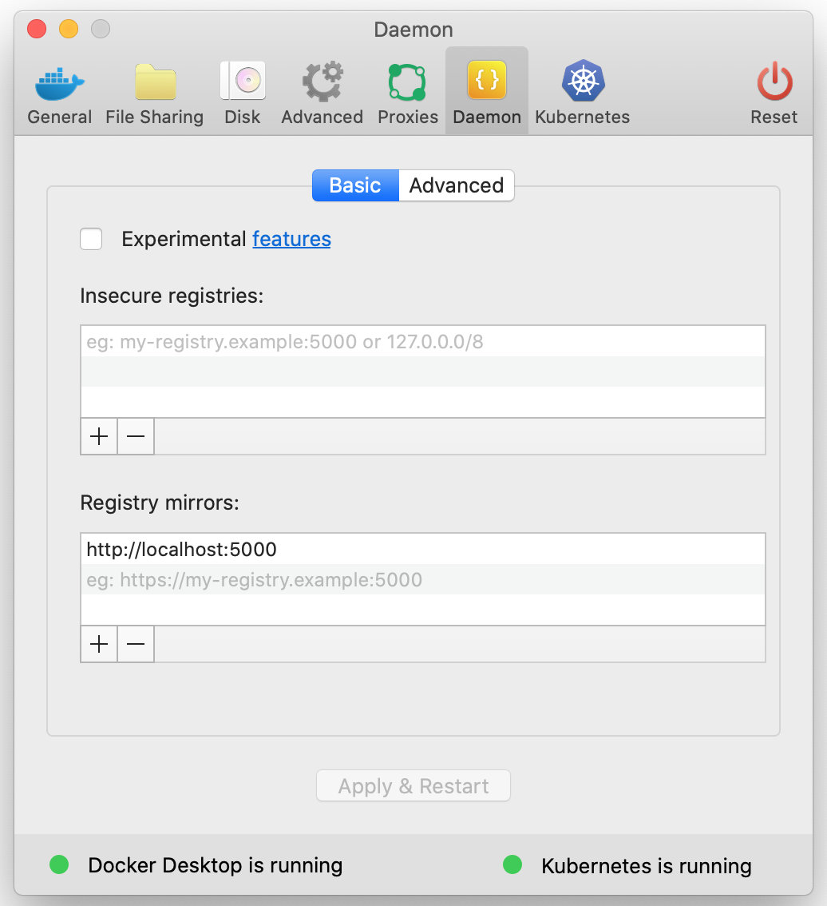

# Cloud Platform Docker Registry Cache

We use a lot of docker images from [docker hub].

Pulling these images can be quite slow, especially if docker hub are having performance problems.

This repository enables us to run an instance of [docker registry] as a 'pull-through' cache, in the cloud platform.

Docker images can be pulled from the cache, which is much faster.

## Running locally

`make run` to start the local registry cache on port 5000

Once this is running, you can test it from another terminal
window like this:

Check the registry is running:

    curl -I http://localhost:5000/v2/

Output should look like this:

    HTTP/1.1 200 OK
    Content-Length: 2
    Content-Type: application/json; charset=utf-8
    Docker-Distribution-Api-Version: registry/2.0
    X-Content-Type-Options: nosniff
    Date: Tue, 10 Dec 2019 14:55:59 GMT

Pull an image from the registry:

    time docker pull localhost:5000/library/alpine
    docker rmi localhost:5000/library/alpine
    time docker pull localhost:5000/library/alpine

The second invocation should be quicker.

### Configure your local docker daemon to use the cache

On your Mac, go to "Docker Preferences" via the Docker icon in your taskbar at
the top of the screen.

As shown in the image, go to the "Daemon" section and add
`http://localhost:5000` to the "Registry mirrors" list, then click "Apply &
Restart"

Once you've done this, you should see activity in the terminal window where the
docker container is running, every time you execute a `docker pull` command.

## Deploying to kubernetes

The yaml files in `cloud-platform-deploy/` assume deployment to:

* Cluster: `docker-cache.cloud-platform.service.justice.gov.uk`
* Namespace: `docker-cache`

You need to edit them to the appropriate values for your setting.

### Create your namespace

`kubectl create namespace docker-cache`

### Deploy

`kubectl -n docker-cache apply -f cloud-platform-deploy/`

### Test

Once you have deployed the app, you should be able to test it like this:

    curl -I https://docker-registry-cache.apps.docker-cache.cloud-platform.service.justice.gov.uk/v2/

You should get similar output as when running on localhost.

## Tell kubernetes nodes to use the cache

https://github.com/kubernetes/kops/blob/master/docs/cluster_spec.md#registrymirrors

Edit the kops spec and add

    docker:
      registryMirrors:
      - https://docker-registry-cache.apps.docker-cache.cloud-platform.service.justice.gov.uk

Then apply the update using `kops update` and `kops rolling-update cluster`

[docker hub]: https://hub.docker.com/
[docker registry]: https://docs.docker.com/registry/recipes/mirror/
